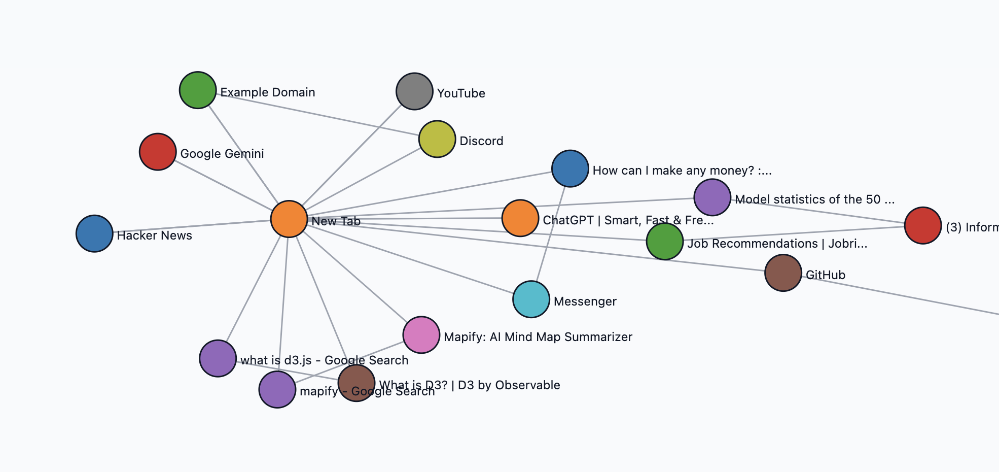

# MindMeld — Research Rabbit Hole Visualizer

Visualizer screenshot — a sample research session map showing nodes and connections. Click any node to open the notes panel.

Overview
--------

MindMeld is a small Chrome extension (Manifest V3) that helps researchers visualize and navigate their "research rabbit holes." It tracks pages you visit during a research session and renders them as an interactive, node-based mind map. Each visited page becomes a node; sequential visits are recorded as edges so you can replay and annotate your research journey.

Why this helps
---------------

- Keeps a structured record of how you discovered sources and which pages led to others.
- Lets you annotate nodes with notes (key insights, quotes, or why a page was useful).
- Visualizes connections between topics and domains to reveal clusters and research paths.

Core MVP features
-----------------

- Session control: start/stop a research session from the extension toolbar.
- Automatic tracking: while a session is active, main-frame navigations are recorded (URL + title).
- Persistent storage: sessions are stored in `chrome.storage.local` as `currentSession`.
- Visualization: a force-directed D3 graph shows nodes and edges; nodes are draggable.
- Notes: click a node to open a notes panel and save text tied to that node.

Data model
----------

currentSession (stored in chrome.storage.local)

{
	nodes: [
		{ id: "https://example.com/article1", title: "Article 1", notes: "Why it mattered..." },
		...
	],
	edges: [
		{ source: "https://example.com/article1", target: "https://example.com/article2" },
		...
	],
	lastVisited: "https://example.com/article2"
}

Concept & algorithm (how nodes connect)
---------------------------------------

1. Session lifecycle
	 - When you click Start Session the extension clears `currentSession` and sets `isSessionActive=true`.
	 - When you Stop Session the extension sets `isSessionActive=false` and preserves the session data.

2. Tracking navigation events
	 - The background service worker listens to `chrome.webNavigation.onCompleted`.
	 - Only main-frame (`frameId === 0`) navigations are considered.
	 - When a navigation occurs and `isSessionActive === true`, the background script:
		 - Reads `currentSession` from storage.
		 - Adds the visited page as a node if it doesn't already exist (node identity is the URL).
		 - If `lastVisited` exists, push an edge { source: lastVisited, target: currentUrl } unless the identical edge already exists.
		 - Update `lastVisited = currentUrl` and write `currentSession` back to storage.

3. Visualization
	 - The visualizer page reads `currentSession` and builds a D3 force-directed graph:
		 - Nodes show the page title (truncated for readability) and are draggable.
		 - Links represent sequential navigation between nodes.
		 - Nodes are color-grouped by hostname by default.

4. Notes per-node
	 - Clicking a node opens a notes panel bound to that node (not firing when dragging).
	 - Notes are stored on the node object in `currentSession.nodes[].notes` and persisted back to `chrome.storage.local`.

How to load & test locally
---------------------------

1. Open Chrome and navigate to `chrome://extensions`.
2. Enable "Developer mode".
3. Click "Load unpacked" and select this repository folder (`mindmeld`).
4. Click the extension icon to Start Session, browse pages, then View Research Map to see the visual graph.

Notes and next steps
--------------------

- D3 loading: The extension prefers a local `lib/d3.v7.min.js` file to comply with extension CSP. For offline or stable builds, replace the placeholder shim with the official minified D3 file.
- Future improvements:
	- Save multiple named sessions and switch between them.
	- Export/import session JSON for sharing or reproducibility.
	- Better deduplication (normalize query parameters) and domain clustering options.
	- Search and filter nodes by text, tags, or notes.

License
-------

MIT — feel free to reuse and adapt the code. Contributions welcome.
